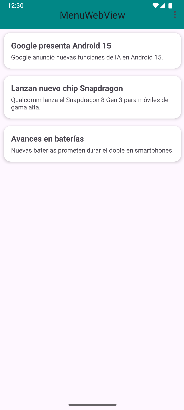
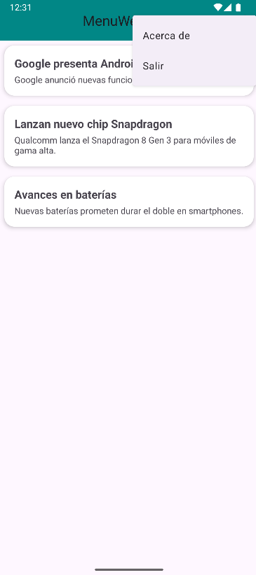
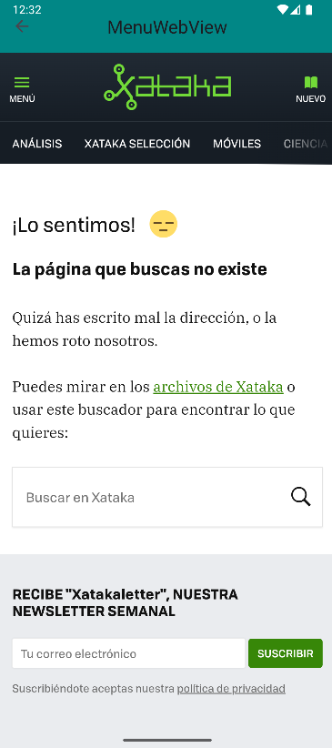

# SEMANA 8
# ALUMNO: LIZA GUERRERO PIERO ALEXANDRO
# CÓDIGO: 0202114037

# MenuWebView

**MenuWebView** es una aplicación móvil Android desarrollada como proyecto académico para el curso **Aplicaciones Móviles** (Ingeniería de Sistemas). El objetivo de esta app es practicar los menús clásicos de Android y el uso de WebView bajo el diseño Material 3.

---

## 🚩 ¿QUÉ HACE LA APLICACIÓN?

La app **MenuWebView** permite:
- Visualizar una lista de **noticias de tecnología** en un diseño moderno.
- Acceder a **menús contextuales y de opciones**:
  - **Options Menu**: El menú de los tres puntos arriba a la derecha (“Acerca de”, “Salir”).
  - **Context Menu**: Menú que aparece al hacer pulsación larga sobre una noticia (“Abrir en WebView”, “Compartir”).
- Consultar la noticia completa en una nueva pantalla con **WebView**.
- Navegar por una interfaz amigable, adaptada a Material Design 3.

---

## 🎨 FUNCIONALIDADES Y COMPONENTES IMPLEMENTADOS

- **Material Design 3:**  
  Toda la app utiliza la última versión de Material Design para colores, tipografías y componentes.
- **Toolbar (AppBar):**  
  Barra superior con menú de opciones.
- **Options Menu:**  
  Menú de los tres puntos, accesible desde el AppBar.
- **Context Menu:**  
  Menú que se despliega al mantener pulsado un elemento de la lista.
- **RecyclerView + CardView:**  
  Lista de noticias mostradas en tarjetas modernas y limpias.
- **WebView:**  
  Permite visualizar el contenido web de cada noticia en una pantalla nueva.
- **Compatibilidad:**  
  Funciona desde Android 7.1 (API 25) hasta versiones recientes.

---

## 🗂️ SECCIONES DE LA APP

- **Noticias:**  
  Muestra noticias de tecnología. Cada noticia incluye título, descripción y un link.
- **Menús:**  
  - **Options Menu:** Opción para ver información de la app y cerrar sesión.
  - **Context Menu:** Opción de abrir la noticia en WebView o compartir (función demo).
- **WebView:**  
  Visualiza la noticia elegida en un navegador embebido.

---

## 🖼️ CAPTURAS DE PANTALLA

<!-- Sube tus imágenes a la carpeta /images del repo y enlaza así: -->

<p align="center">
  
  
  
</p>

---

## 🔨 CÓMO SE HIZO

1. **Proyecto creado en Android Studio con Kotlin y Material 3.**
2. **Tema personalizado definido** en `themes.xml` y colores en `colors.xml`.
3. **Menú de opciones** implementado en el AppBar con archivo XML (`menu_options.xml`).
4. **Menú contextual** implementado en la lista con archivo XML (`menu_context.xml`).
5. **Lista de noticias** usando RecyclerView y CardView (`item_noticia.xml`).
6. **WebView** embebido en una nueva actividad para mostrar el contenido web.
7. **Código limpio, modular y orientado a buenas prácticas.**

---

## 💻 INSTALACIÓN Y USO

1. Clona el repositorio:

```bash
git clone https://github.com/tuusuario/MenuWebView.git

```

2. Abre el proyecto en Android Studio.

3. Sincroniza las dependencias (Material 3, etc.).

4. Ejecuta la app en un emulador o dispositivo físico (Android 7.1/API 25+).

## ⚡ NOTAS FINALES
1. **App desarrollada solo con fines educativos.**
2. **Las noticias mostradas son de ejemplo; puedes personalizarlas editando la lista en el código.**
